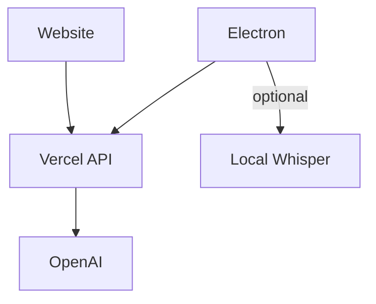

# Interview AI

## Architecture Overview

The Interview AI system follows a simplified client-server architecture where all clients communicate through a centralized Vercel API proxy.

### Components

- **Electron Client**: Local desktop application with main UI and optional floating window. Can optionally run local Whisper for speech-to-text. All requests go through Vercel API.
- **Website**: Web-based frontend hosted on Vercel, using the same API endpoints as the Electron client.
- **Vercel**: Serves as both the API proxy (forwarding to OpenAI, managing API keys, checking usage) and hosts the website frontend.
- **OpenAI**: Only accessible through Vercel; clients never communicate with OpenAI directly.

### Architecture Diagram



### Build System

The project uses Bazel for building Electron, tools, and managing dependencies. Bazel is not part of the runtime architecture and targets are kept simple and minimal.

For detailed architecture documentation, see [docs/architecture.md](docs/architecture.md).

## Getting Started

### Prerequisites

- Node.js 20+
- npm or yarn
- Bazel (for building Electron)
- Vercel account (for deployment)

### Installation

1. Clone the repository:
```bash
git clone <repository-url>
cd interview-ai
```

2. Install dependencies:
```bash
npm install
```

3. Set up environment variables:
   - Copy `.env.example` to `.env` (if not blocked)
   - Set `OPENAI_API_KEY` in your Vercel project environment variables
   - Set `VERCEL_API_URL` to your deployed Vercel URL

### Development

#### Website (Next.js)
```bash
cd website
npm install
npm run dev
```

#### Electron Client
```bash
cd electron
npm install
npm run build
npm start
```

### Deployment

1. Deploy to Vercel:
```bash
vercel
```

2. Set environment variables in Vercel dashboard:
   - `OPENAI_API_KEY`: Your OpenAI API key

3. The API routes will be available at `/api/chat`, `/api/speech`, and `/api/usage`

### Building with Bazel

```bash
# Build Electron
bazel build //electron:electron-app

# Build Website
bazel build //website:website-package
```

## Project Structure

```
.
├── api/                 # Vercel API routes
│   ├── chat.ts         # Chat API endpoint
│   ├── speech.ts       # Speech-to-text API endpoint
│   └── usage.ts        # Usage tracking API endpoint
├── electron/           # Electron desktop client
│   ├── src/           # Main process code
│   └── renderer/      # Renderer process HTML
├── website/           # Next.js web frontend
│   └── app/          # Next.js app directory
├── docs/             # Documentation
├── BUILD             # Bazel build file
└── WORKSPACE         # Bazel workspace
```

