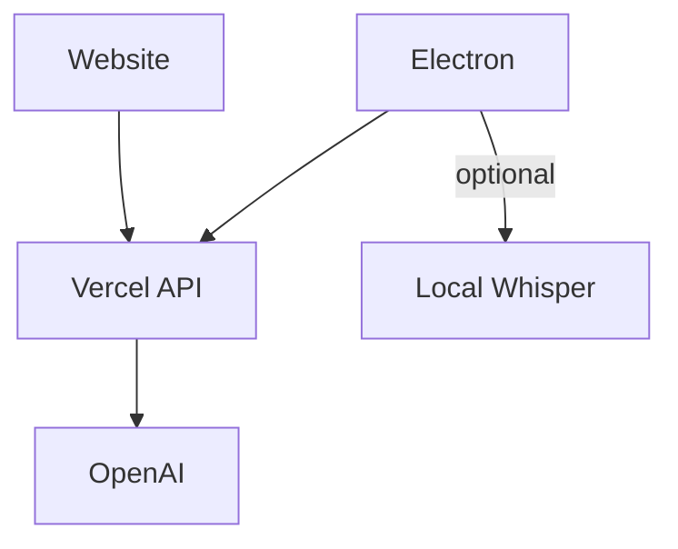

# Interview AI

## Architecture Overview

The Interview AI system follows a simplified client-server architecture where all clients communicate through a centralized Vercel API proxy.

### Components

- **Electron Client**: Local desktop application with main UI and optional floating window. Can optionally run local Whisper for speech-to-text. All requests go through Vercel API.
- **Website**: Web-based frontend hosted on Vercel, using the same API endpoints as the Electron client.
- **Vercel**: Serves as both the API proxy (forwarding to OpenAI, managing API keys, checking usage) and hosts the website frontend.
- **OpenAI**: Only accessible through Vercel; clients never communicate with OpenAI directly.

### Architecture Diagram



### Build System

The project uses Bazel for building Electron, tools, and managing dependencies. Bazel is not part of the runtime architecture and targets are kept simple and minimal.

For detailed architecture documentation, see [docs/architecture.md](docs/architecture.md).

## Features

- **Voice Call Interview Mode**: Real-time voice conversation like a phone call
  - Click the call button to start/end interview
  - Continuous speech recognition (listens automatically)
  - Natural back-and-forth conversation flow
  - Speech-to-text using Whisper API
  - AI responses using GPT-4o mini
  - Text-to-speech playback using OpenAI TTS
  - Visual indicators for listening/speaking states
  - Transcript view to see conversation history
- **Behavioral Question (BQ) Interviews**: Specialized prompts for BQ interviews
- **Call Interface**: Beautiful voice call UI with status indicators
- **Floating Window**: Quick access floating window for easy interaction

## Getting Started

### Prerequisites

- Node.js 20+
- npm or yarn
- Bazel (for building Electron)
- Vercel account (for deployment)

### Installation

1. Clone the repository:
```bash
git clone <repository-url>
cd interview-ai
```

2. Install dependencies:
```bash
npm install
```

3. Set up environment variables:
   - Copy `website/.env.local.example` to `website/.env.local`
   - Set `OPENAI_API_KEY` with your OpenAI API key
   - Get your API key from https://platform.openai.com/api-keys

### Development

#### Website (Next.js)
```bash
cd website
npm install
npm run dev
```

#### Electron Client

**Prerequisites:**
- The API server must be running (either locally or on Vercel)
- For local development, start the website dev server first:
  ```bash
  cd website
  npm run dev
  # This starts the Next.js server on http://localhost:3000
  ```

**Running Electron:**
```bash
cd electron
npm install
npm run build
npm start
```

**For local development with API:**
```bash
# Terminal 1: Start the API server
cd website
npm run dev

# Terminal 2: Start Electron
cd electron
npm run dev:local
```

**Using Voice Call Mode:**
1. Click the green call button (📞) to start the interview
2. Grant microphone permissions when prompted
3. Speak naturally - the system will automatically detect your speech
4. The interviewer will respond with voice
5. Click the red end button (📴) to end the call
6. Toggle transcript view to see conversation history

**Troubleshooting:**
- If you see "Cannot connect to API server" error:
  - Make sure the website dev server is running (`cd website && npm run dev`)
  - Or set `VERCEL_API_URL` environment variable to your deployed Vercel URL
  - Or set `API_URL` environment variable to your API server URL

### Environment Setup

1. Create `website/.env.local` file:
```bash
cd website
cp .env.local.example .env.local
```

2. Edit `.env.local` and add your OpenAI API key:
```
OPENAI_API_KEY=your_openai_api_key_here
```

**Note:** All API routes run locally in Next.js. No Vercel deployment needed for local development.

### Building with Bazel

```bash
# Build Electron
bazel build //electron:electron-app

# Build Website
bazel build //website:website-package
```

## Project Structure

```
.
├── api/                 # Vercel API routes
│   ├── chat.ts         # Chat API endpoint
│   ├── interview.ts    # Interview API endpoint (with prompts)
│   ├── speech.ts       # Speech-to-text API endpoint
│   ├── tts.ts          # Text-to-speech API endpoint
│   └── usage.ts        # Usage tracking API endpoint
├── prompts/            # Interview prompts
│   ├── bq_interview.md # Behavioral question interview prompt
│   └── README.md       # Prompts documentation
├── proto/              # Protocol Buffer definitions
│   ├── interview.proto # Message definitions
│   └── README.md       # Proto documentation
├── electron/           # Electron desktop client
│   ├── src/           # Main process code
│   └── renderer/      # Renderer process HTML
├── website/           # Next.js web frontend
│   └── app/          # Next.js app directory
├── docs/             # Documentation
├── BUILD             # Bazel build file
└── WORKSPACE         # Bazel workspace
```

